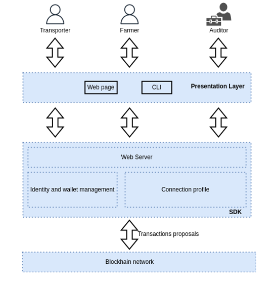
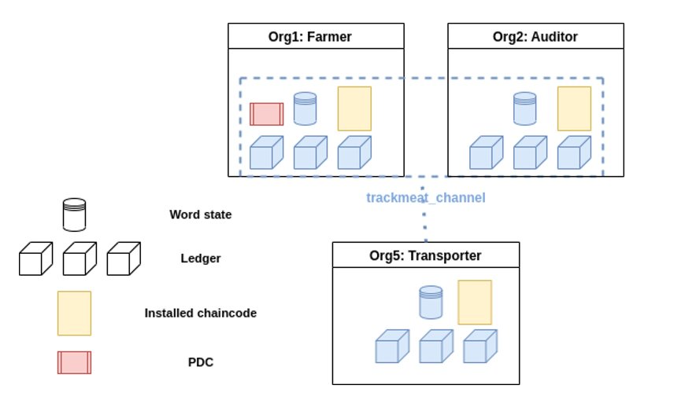

# Agriculture data space tracking web app using Hyperledger Fabric
This project demonstrates the use of the Blockchain technology for tracking meat products. In this application, we have 3 organizations involved, namely auditors, farmers and transporters. Farmers are responsible for registering meat products on the network and providing a CO2 footprint. Auditors have only a read access on the ledger and can see all records related to the meat products. Transporters are responsible of creating packages and transporting meat products to the retailers. 

# Problem statement: 
TODO

# Life cycle of transactions 

=> After getting enrolled and registered, Farmers will be able to register their meat products on the web app by providing their identity. In addition to that, farmers need to provide a CO2 footprint value which represents the total greenhouse gas emissions cause by the meat processing.

=> Transporters will be able to create meat packages by providing the meat product id to be transported.

=> Meat products CO2 footprint will be updated according to the distances traveled. 

=> Auditors will be able to see all the ledger data and will use it for auditing purposes. 


# Prerequisites
TODO


# Architecture

<p align="center">
    
</p>

# Instructions

## Step 1: start the network using fablo tool, enroll/register admins and users for each organization

This project is using Fablo, which is a simple to generate Hyperledger Fabric blockchain network and run it on Docker. From a simple .yaml file specified under `/fablo-network/fablo-config.yaml`, the network is started with all the required peers. The number of peers, channel name, and ordering service type can be directly modified in the `fablo-config.yaml`. Please consult the official documentation of [fablo](https://github.com/hyperledger-labs/fablo) if you plan to change the network configuration file.

**1.1** Under `/fablo-network`, execute: 

```bash
    ./fablo recreate ./fablo-config.yaml
```

<p align="center">
    
</p>


**1.2** Under `/fablo-network/scripts`, execute: 

```bash
node enrollAdmin.js Farmer
node enrollAdmin.js Auditor
node enrollAdmin.js Transporter

node registerEnrollUser.js Farmer user1
node registerEnrollUser.js Auditor user2
node registerEnrollUser.js Transporter user3
```

after executing those commands, we will have 3 users registered on the network with their identities (user1, user2, user3)

## Step 2: start the express server

under `\web-app\servers` , execute:

```bash
npm install
node app.js
```

The Server will be listening on Port 8095 and all incoming requests will be forwarded to the network Gateway. The connection profile needed to connect to the Gateway will be loaded based on the invoked function on the client side. For example, if the client invokes "registerUser" with identity user1, we will use the connection profile for farmers (`web-app/servers/fabric/connection-profile-farmerorg.json`) with identity "user1" to connect to the gateway. 


## Step 3: start the client

under web-app/client, install the required dependencies and start the client by executing:

```bash
npm install
npm start
```


